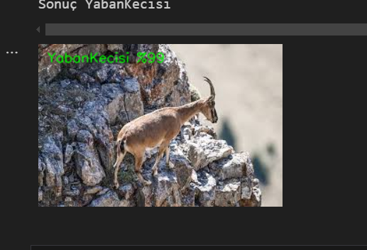
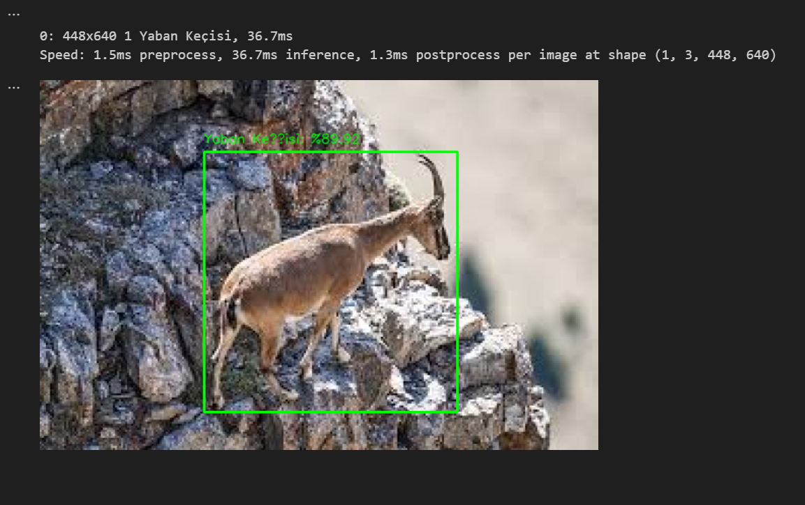
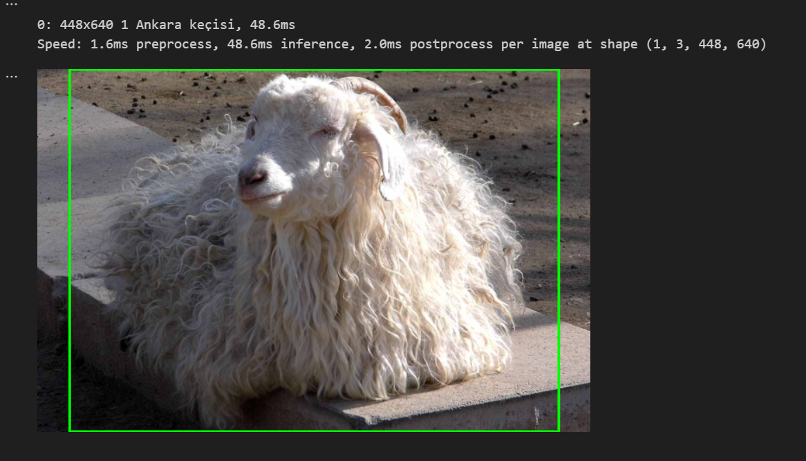

# 🐐 Keçi Türleri & Böcek/Sürüngen Tespiti – YOLOv8 / YOLOv11 Projesi

Bu proje, görüntüler üzerinde hem **image classification** (resim sınıflandırma) hem de **object detection** (nesne tespiti) tekniklerini kullanarak iki temel alanda çalışır:

- **Keçi Türleri Tespiti** (YOLOv8l-cls, YOLOv11l, YOLOv11n)
- **Zararlı Böcekler, Sürüngenler, Akrepler, Yengeçler** gibi canlıların tespiti (YOLOv11n)

## 📁 Proje İçeriği

### 1. Keçi Türleri – Image Classification (YOLOv8l-cls)

- **Model**: YOLOv8l-cls
- **Veri Seti**: 2,480 etiketli görüntü
- **Etiketleme**: `makesense.ai`
- **Veri Artırma**: Roboflow ile yapıldı
- **Eğitim Parametreleri**:
  - Epoch: 100
  - Görüntü boyutu: 640x640
  - Batch size: 8
  - Workers: 8
- **Donanım**: Google Colab (GPU)

#### Sınıflandırılan Keçi Türleri (Toplam 9 Tür)
- Ankara Keçisi (244)
- Halep Keçisi (273)
- Honamlı Keçisi (135)
- Kilis Keçisi (76)
- Kıl Keçisi (134)
- Malta Keçisi (64)
- Norduz Keçisi (29)
- Saanen Keçisi (212)
- Yaban Keçisi (1296)
> Ayrıca, **Halep** ve **Yaban keçisi** birlikte bulunan 17 görsel mevcut.

#### Performans
- **mAP@0.5**: 0.87 -> Model, nesneleri %87 doğrulukla tespit ediyor (yüksek IoU threshold'unda bile iyi performans).
- **mAP@0.5:0.95**: 0.63 -> Nesne lokalizasyonunda ortalama doğruluk %63. Bu, modelin nesne sınırlarını tam olarak belirlemede zayıf kaldığını gösterir.

- **Precision**: 0.89 -> Tespit edilen nesnelerin %89'u doğru (yanlış pozitif oranı düşük).
- **Recall**: 0.85 -> Gerçek nesnelerin %85'ini tespit edebiliyor (kaçırılan nesneler var).

<!-- Görsel örneği --> 

---

### 2. Keçi Türleri – Object Detection

#### A) YOLOv11l
- Daha doğru ama daha yavaş
- Kullanılan model: `YOLOv11l`
- Epoch: 100, Görüntü boyutu: 640x640
- Batch size: 8, Workers: 8
- Donanım: Google Colab

<!-- Detected output örneği -->

#### B) YOLOv11n
- Daha hafif ve hızlı model
- Kullanılan model: `YOLOv11n`
- Epoch: 100, Görüntü boyutu: 640x640
- Batch size: 8, Workers: 8
- Donanım: Google Colab
- Video üzerinden tahminlerde `ONNX` dönüştürmesi yapıldı

<!-- Detected output örneği -->

---

### 3. Böcek, Sürüngen ve Akrep Tespiti (YOLOv11n)

- 45 farklı tür üzerinde nesne tespiti yapılmıştır
- Toplam görüntü sayısı: **20,232**
- Veri setleri: Roboflow'dan 8 farklı kaynak birleştirildi
- Eğitilen türlerden bazıları:
    - Akdeniz Münzevi Örümceği: 3030
    - Anadolu Sarı Akrebi: 3535
    - Kara Akrep: 2740
    - Katil Arı: 87
    - Yaprak Biti: 90
    - Ordu Kurtları: 753
    - Batı Mısır Kök Kurdu: 105
    - Kahverengi Kokarca Böceği: 558
    - Cabbage Loopers: 90
    - Lahana Tırtılları: 720
    - Charybdis Natator: 722
    - Narenciye Kanseri: 87
    - Colorado Patates Böcekleri: 87
    - Mısır Kurdu: 87
    - Mısır Yuvarlak Kurdu: 186
    - Sonbahar Ordu Kurdu: 90
    - Sirke Sineği: 207
    - Heterometrus indus: 221
    - Heterometrus swammerdami: 291
    - Hottentotta jayakari: 137
    - Hottentotta tamulus: 248
    - Leiurus quinquestriatus: 274
    - İmparator Akrep: 76
    - Patates Böceği: 87
    - Kum Yengeci: 728
    - Portunus sanguinolentus: 688
    - Kırmızı Örümcek: 358
    - Trips: 102
    - Tomato Hornworms: 595
    - Zosimus aeneus: 84
    - Mavi Yengeç: 742
    - Kemancı Yengeç: 55
    - Hayalet Boynuzlu Yengeç: 43
    - Legume blister beetle: 69
    - Sally Lightfoot Yengeci: 242
    - Çamur Yengeci: 48
    - Pirinç Gal Sineği: 50
    - Pirinç Yaprak Kıvırıcısı: 265
    - Rice leafhopper: 250
    - Rice water weevil: 252
    - Genel “Akrepler” sınıfı: 257
    - Florida Taş Yengeci: 3
    - Wheat phloeothrips: 66
    - Beyaz Sırtlı Bitki Zararlısı: 246
    - Yellow Rice Borer: 256

#### Performans
- **mAP@0.5**: 0.98 -> Model, nesneleri %97.79 doğrulukla tespit ediyor (düşük IoU threshold'unda çok yüksek performans).
- **mAP@0.5:0.95**: 0.79 -> Nesne lokalizasyonunda ortalama doğruluk %78.95. Bu, modelin nesne sınırlarını daha hassas belirlemede geliştirmeye açık olduğunu gösterir.
- **Precision**: 0.89 -> Tespit edilen nesnelerin %88.78’i doğru (yanlış pozitif oranı makul seviyede).
- **Recall**: 0.97 -> Gerçek nesnelerin %97.41’i tespit edilebiliyor (kaçırılan nesne oranı oldukça düşük).

<!-- Detected akrep örneği -->

---

## 🛠️ Kullanılan Araçlar ve Teknolojiler

- [YOLOv8](https://github.com/ultralytics/ultralytics)
- [YOLOv11](https://github.com/WongKinYiu/yolov11) (deneysel sürüm)
- Google Colab & Kaggle (GPU desteği)
- Roboflow (veri artırma ve dönüştürme)
- Makesense.ai (etiketleme)
- OpenCV & ONNX Runtime (video üzerinden tespit)

