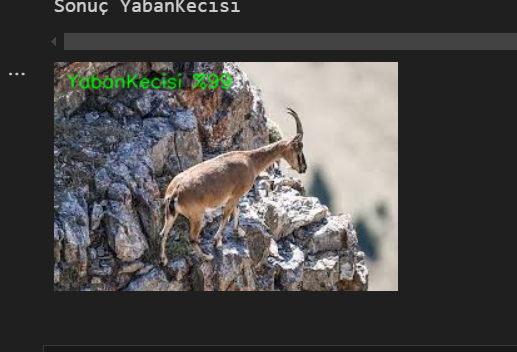
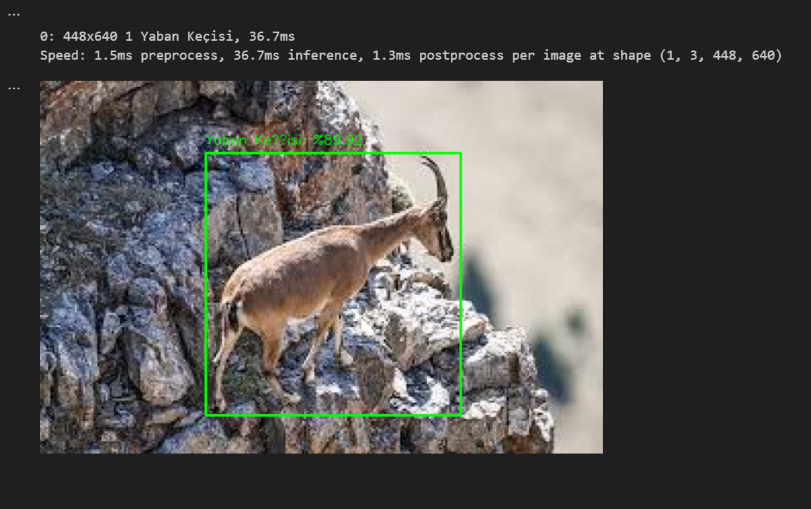
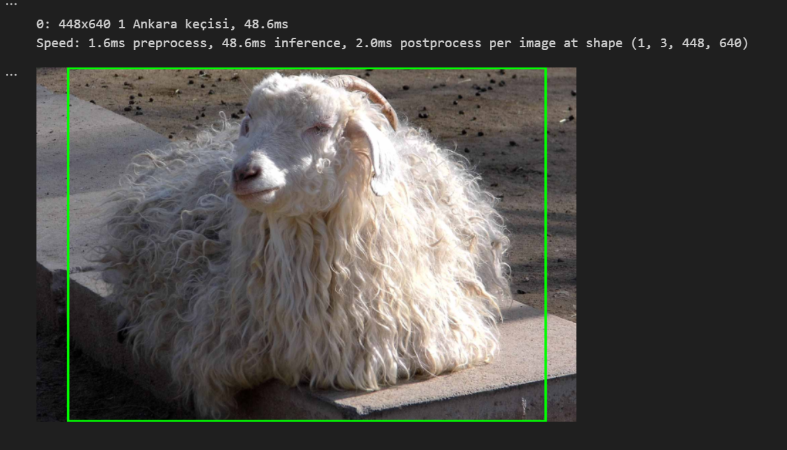
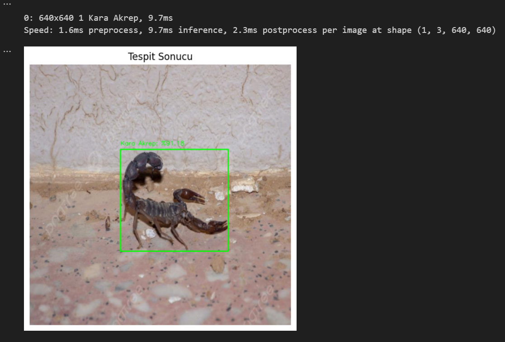

# 🐐 Keçi Türleri & Böcek/Sürüngen Tespiti – YOLOv8 / YOLOv11 Projesi

Bu proje, görüntüler üzerinde hem **image classification** (resim sınıflandırma) hem de **object detection** (nesne tespiti) tekniklerini kullanarak iki temel alanda çalışır:

- **Keçi Türleri Tespiti** (YOLOv8l-cls, YOLOv11l, YOLOv11n)  
- **Zararlı Böcekler, Sürüngenler, Akrepler, Yengeçler** gibi canlıların tespiti (YOLOv11n)  

---

## 📁 Proje İçeriği

### 1. Keçi Türleri – Image Classification (YOLOv8l-cls)

- **Model**: YOLOv8l-cls  
- **Veri Seti**: 2.480 etiketli görüntü  
- **Etiketleme**: `makesense.ai`  
- **Veri Artırma**: Roboflow ile yapıldı  
- **Eğitim Parametreleri**:  
  - Epoch: 100  
  - Görüntü boyutu: 640x640  
  - Batch size: 8  
  - Workers: 8  
- **Donanım**: Google Colab (GPU)  

#### Sınıflandırılan Keçi Türleri (Toplam 9 Tür)
- Ankara Keçisi  
- Halep Keçisi  
- Honamlı Keçisi  
- Kilis Keçisi  
- Kıl Keçisi  
- Malta Keçisi  
- Norduz Keçisi  
- Saanen Keçisi  
- Yaban Keçisi  
- Ayrıca, **Halep** ve **Yaban keçisi** birlikte bulunan 17 görsel mevcut.  

---

### 2. Keçi Türleri – Object Detection

#### A) YOLOv11l
- Daha doğru ama daha yavaş  
- **Kullanılan model**: YOLOv11l  
- **Epoch**: 100  
- **Görüntü boyutu**: 640x640  
- **Batch size**: 8  
- **Workers**: 8  
- **Donanım**: Google Colab  

---

#### B) YOLOv11n
- Daha hafif ve hızlı model  
- **Kullanılan model**: YOLOv11n  
- **Epoch**: 400  
- **Görüntü boyutu**: 640x640  
- **Batch size**: 16  
- **Workers**: 8  
- **Donanım**: Kaggle (GPU)  
- **Optimizer**: AdamW  
- **Learning rate**: lr0=0.005, lrf=0.001  
- **Veri artırımı**: Açık (augment=True), Mosaic ve Mixup dahil  
- **Patience**: 50  
- **Model kaydı adı**: yolov11n_keciler_detection  

#### Veri Seti
- **Toplam Görüntü**: 10.517 (veri artırımı sonrası)  
- Keçi türleri ve örnek sayıları:  
  - Ankara Keçisi: 1023  
  - Halep Keçisi: 765  
  - Honamlı Keçisi: 814  
  - Kilis Keçisi: 940  
  - Kıl Keçisi: 1275  
  - Malta Keçisi: 810  
  - Norduz Keçisi: 702  
  - Saanen Keçisi: 887  
  - Yaban Keçisi: 3301  

#### Performans (YOLOv11n)
- **Train Loss**:  
  - train/box_loss = 1.05399  
  - train/cls_loss = 1.02224  
  - train/dfl_loss = 1.50112  
  - Toplam train loss ≈ 3.57735  
- **Validation Loss**:  
  - val/box_loss = 1.26823  
  - val/cls_loss = 0.84737  
  - val/dfl_loss = 1.68639  
  - Toplam val loss ≈ 3.80199  
- **Precision / Recall / F1 (Validation)**:  
  - Precision = 0.79162 (79.2%)  
  - Recall = 0.74188 (74.2%)  
  - F1-score ≈ 0.7666 (76.7%)  
- **mAP değerleri**:  
  - mAP@0.5 = 0.80067 (80.1%)  
  - mAP@0.5:0.95 = 0.53310 (53.3%)  
- **Learning Rate (epoch 55)**:  
  - lr/pg0 = lr/pg1 = lr/pg2 = 4.10001e-05  

---

### 3. Böcek, Sürüngen ve Akrep Tespiti – Object Detection (YOLOv11n)

- **Model**: YOLOv11n (hafif ve hızlı)  
- **Epoch**: 100  
- **Görüntü boyutu**: 640x640  
- **Batch size**: 8  
- **Workers**: 8  
- **Donanım**: Kaggle (GPU)  
- **Learning rate**: lr0=0.005, lrf=0.2  
- **Patience**: 10  
- **Model kaydı adı**: SurungenBocek_detection  
- Video üzerinden tahminlerde **ONNX** dönüştürmesi kullanıldı  

#### Veri Seti – Örnek Sınıflar
- Kırmızı Örümcek: 2.481  
- Akdeniz Münzevi Örümceği: 3.432  
- Anadolu Sarı Akrebi: 4.602  
- Mısır Yuvarlak Kurdu: 2.029  
- Katil Arı: 2.049  
- Kahverengi Kokarca Böceği: 2.396  
- Sirke Sineği: 1.879  
- Yaprak Biti: 2.394  
- Mısır Kurdu: 2.010  
- Patates Böceği: 1.995  
- Sonbahar Ordu Kurdu: 2.000  
- Kara Akrep: 2.796  
- **Toplam Görüntü**: 30.063  

#### Performans
- **Train Loss**:  
  - train/box_loss = 0.64774  
  - train/cls_loss = 0.34560  
  - train/dfl_loss = 1.25217  
  - Toplam train loss ≈ 2.24551  
- **Validation Loss**:  
  - val/box_loss = 0.77869  
  - val/cls_loss = 0.39723  
  - val/dfl_loss = 1.24312  
  - Toplam val loss ≈ 2.41904  
- **Precision / Recall / F1 (Validation)**:  
  - Precision = 0.86543 (86.5%)  
  - Recall = 0.88685 (88.7%)  
  - F1-score ≈ 0.8765 (87.7%)  
- **mAP değerleri**:  
  - mAP@0.5 = 0.88933 (88.9%)  
  - mAP@0.5:0.95 = 0.70852 (70.9%)  
- **Learning Rate (epoch 100)**:  
  - lr/pg0 = lr/pg1 = lr/pg2 = 0.00208  

---

## 🛠️ Kullanılan Araçlar ve Teknolojiler

- **YOLOv8**  
- **YOLOv11**  
- **Google Colab & Kaggle** (GPU desteği)  
- **Roboflow** (veri artırma ve dönüştürme)  
- **Makesense.ai** (etiketleme)  
- **OpenCV & ONNX Runtime** (video üzerinden tespit)
